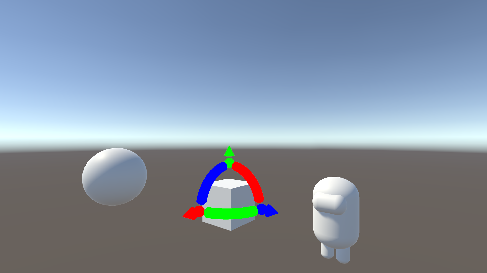

# PBXRGizmo
Runtime translation, scale, rotation modification in Unity.

 
## How to compile
Clone this repo, then open its containing foler in Unity version 2020.3.42f1

## Controls
Run the project, then left click on any object to spawn an object manipulation gizmo on it. Hold left click and drag on the gizmo to transform it.
The camera can be moved with WASD, Space, and LCtrl. You can rotate the camera by holding right click and dragging.
